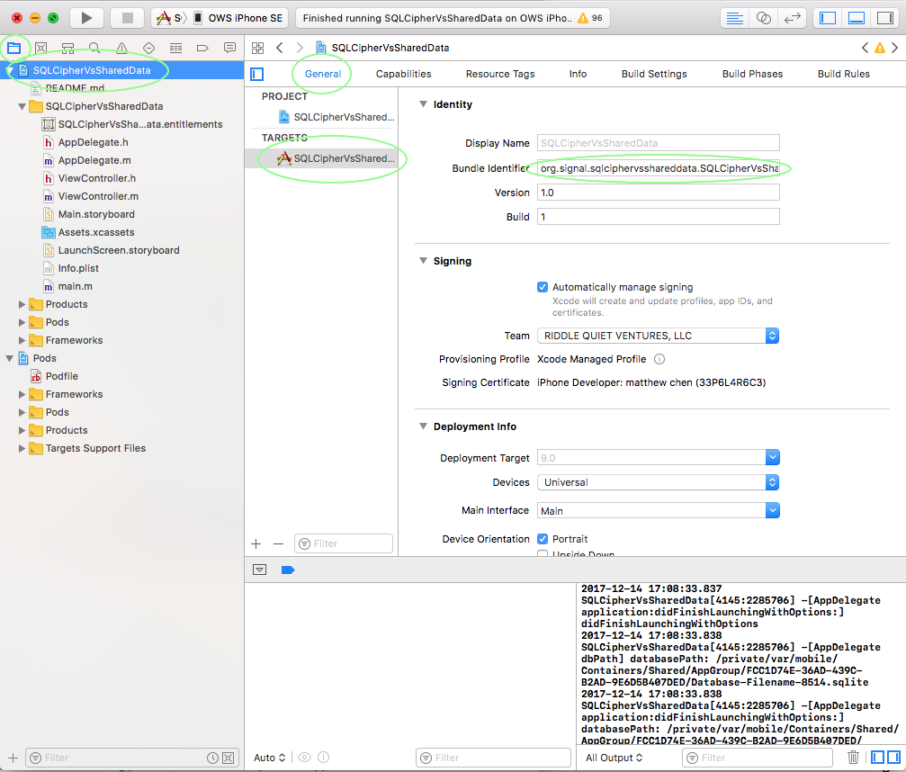
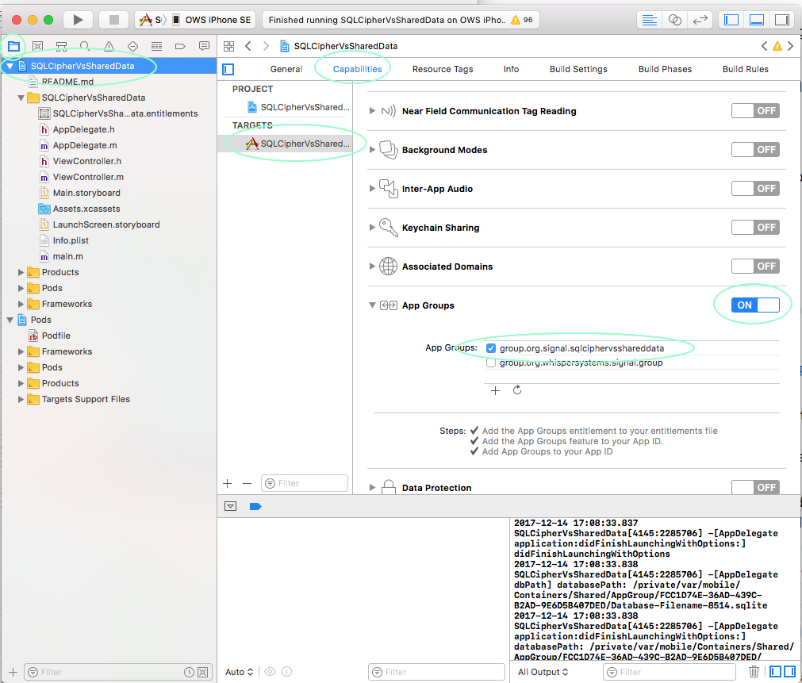
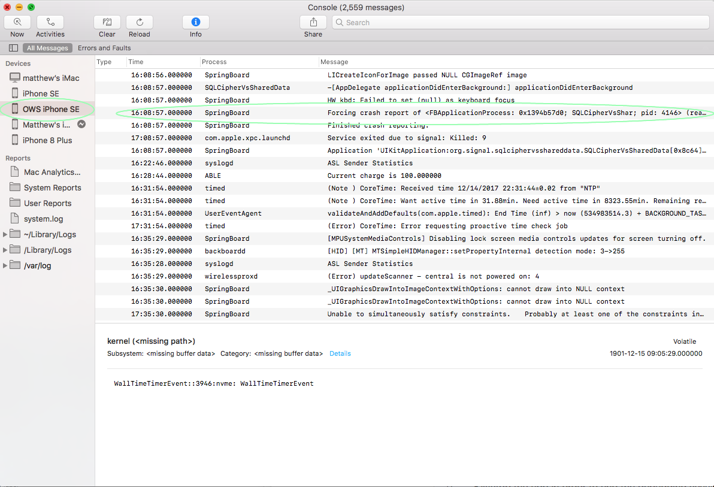

# SQL Cipher vs. shared data containers

### Summary

iOS apps can't share an encrypted database with app extensions (e.g. share extensions) without being terminated every time they enter the background.

iOS won't let suspended apps retain a file lock on apps in the "shared data container" used to share files between iOS apps & their app extensions.

This seems to affect all versions of iOS and all device models.

This issue can be reproduced with very simple SQLite/SQLCipher code, but there is a little bit of complexity around using a "shared data container" on an iOS device.  This demo app takes care of that.


### Discussion

* To share a database (or any other file) between an iOS app and iOS app extension (e.g. a share extension), the file must reside in the "shared data container", a special area of the file system accessible by all apps in an "app group".
  * See: https://developer.apple.com/library/content/documentation/General/Conceptual/ExtensibilityPG/ExtensionScenarios.html
* iOS terminates apps almost immediately if they retain a file lock on any file in the shared data container while being suspended.
  * See Apple's documentation https://developer.apple.com/library/content/technotes/tn2151/_index.html
`
The exception code 0xdead10cc indicates that an application has been terminated by the OS because it held on to a file lock or sqlite database lock during suspension. If your application is performing operations on a locked file or sqlite database at suspension time, it must request additional background execution time to complete those operations and relinquish the lock before suspending.
`
  * iOS only terminates apps for this reason when app transition from the `background` to `suspended` states.  iOS main apps can delay being suspended by creating a "background task", but this only defers the issue briefly as there are strict limits on the duration of "background tasks".
  * `0xdead10cc` terminations don't occur in the simulator and won't occur on devices if the debugger is attached.
  * These `0xdead10cc` terminations usually don't yield crash logs on the device, but always show up in the device console logs.
* SQLCipher databases appear to retain a file lock on the database file at all times in some configurations, even when the database is not being accessed.
  * This demo app demonstrates this behavior using an empty database with encryption enabled and  `journal_mode = WAL`.
  * There may be other configurations that also demonstrate this issue.
  * SQLCipher databases without encryption enabled _DO NOT_ exhibit this issue.
* iOS apps which keep an encrypted SQLCipher database open at all times are terminated every time it is sent to the background, even if they are not doing any explicit database access.

### Steps to Reproduce

This issue doesn't reproduce in a simulator, so we're going to need to run on an actual iOS device (not a simulator), which means we'll need to use valid "app ids" and "app group ids".

This demo app:

* Creates a _new_ database (located in an iOS shared data container) using `sqlite3_open_v2()`  and `SQLITE_OPEN_READWRITE | SQLITE_OPEN_CREATE | SQLITE_OPEN_NOMUTEX | SQLITE_OPEN_PRIVATECACHE`.
* Encrypts that database using `sqlite3_key()`.
* Enables write-ahead logging by executing `PRAGMA journal_mode = WAL` with  `sqlite3_exec()`.
* Creates a table by executing `CREATE TABLE groups ( group_id integer PRIMARY KEY )` with  `sqlite3_exec()`.

Every time you run the app on a physical device (without the debugger attached), then send it to background, it will be terminated immediately by iOS.  This can be observed in the console.

Note: iOS may immediately relaunch the app in the background a few times, but it will re-terminate it each time.

### How to use this demo app:

* Make sure you have an active iOS Developer Account and an iOS device running iOS 9 or later.
* You need to create your own app id and app group, since you'll need to code sign the app using your developer account.
  * Go to Apple's iOS developer center
  * https://developer.apple.com/account/ios/identifier
  * Create a new app group.
     * The description doesn't matter.
     * Select an "app group id" like "group.com.yourcompany.something".
  * Create a new application id.
    * The description doesn't matter.
    * Select an "app id" like "com.yourcompany.something".
    * Enable App Groups & configure App Groups using the "app group id" you created above.
* Download this demo project and open it in a recent XCode (e.g. 9.x).

* Change App Id
  * Select the Project Navigator (left tab in left pane).
  * Select SQLCipherVsSharedData workspace.
  * Select SQLCipherVsSharedData target in left pane of editor.
  * Select General tab.
  * Change the bundle id to match the "app id" you created above.
* Change Group Id
  
  * Select Capabilities tab.
  * Make sure the "app groups" capability is enabled and _only_ the "app group id" you selected above is active.
* Code Changes
  * Open AppDelegate.m.
  * Modify kApplicationGroupId constant to reflect the "app group id" you created above.
* Reproducing the Termination
  * Run the app on your device - _NOT_ the simulator.
  * iOS doesn't terminate apps with 0xdead10cc in the simulator.
  * If you have signing problems, contact me at matthew@whispersystems.org.
  * Kill/stop the app in order to end the debugging session.
  * iOS doesn't terminate apps with 0xdead10cc if the debugger is attached.

  * On your attached Mac, open the Console app and select your iOS device in the left sidebar.
  * Launch the app.
  * Send the app to the background.
  * In Console (on your mac), you should see an entry like this:
  
  ```
  default    16:08:57.000000 -0500    SpringBoard     Forcing crash report of <FBApplicationProcess: 0x1394b57d0; SQLCipherVsShar; pid: 4146> (reason: 4, description: <FBApplicationProcess: 0x1394b57d0; SQLCipherVsShar; pid: 4146> was suspended with locked system files:
  /var/mobile/Containers/Shared/AppGroup/FCC1D74E-36AD-439C-B2AD-9E6D5B407DED/Database-Filename-51898.sqlite)
  
```
 
